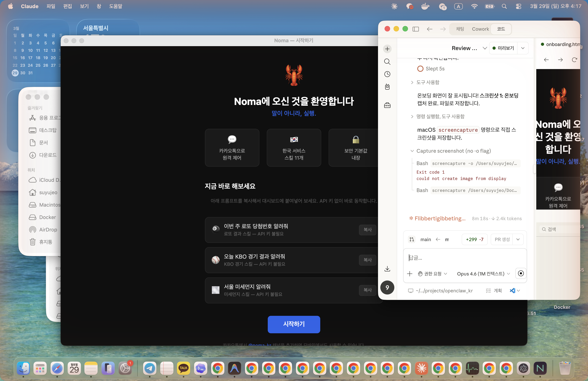
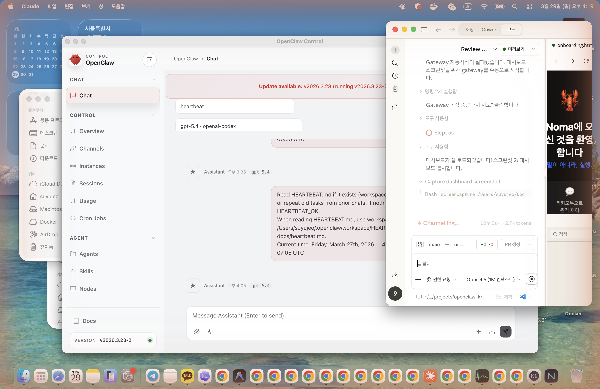
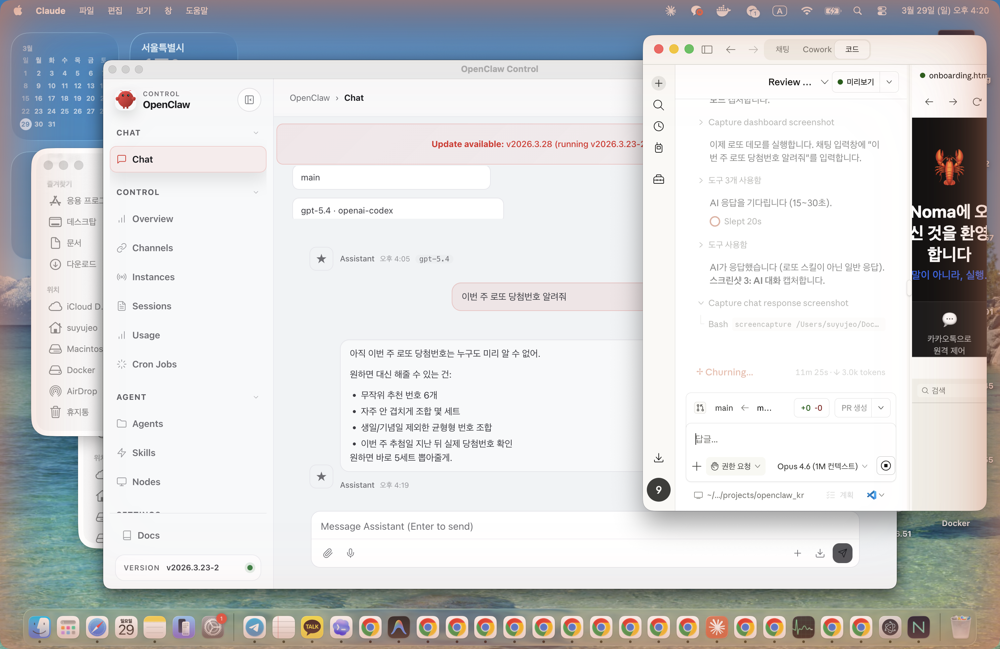

# Noma 설치 가이드

> 터미널 없이 AI 에이전트를 설치하고 실행하는 방법

## 사전 준비

- **ChatGPT 계정** 또는 **Gemini API 키** (AI 연결용)
- Node.js나 터미널 설치는 필요 없습니다 — 앱에 모두 포함되어 있습니다

## 1. 다운로드

[GitHub Release 페이지](https://github.com/noma-openproject/openclaw-kr/releases/tag/v0.1.0-alpha.2)에서 운영체제에 맞는 파일을 다운로드하세요.

| OS | 파일명 | 비고 |
|---|---|---|
| macOS (Apple Silicon) | `Noma-0.1.0-alpha-arm64.dmg` | M1/M2/M3/M4 |
| macOS (Intel) | `Noma-0.1.0-alpha.dmg` | Intel Mac |
| Windows | `Noma.Setup.0.1.0-alpha.exe` | Windows 10/11 |

## 2. 설치

### macOS
1. `.dmg` 파일을 더블클릭하여 마운트합니다
2. `Noma.app`을 **Applications** 폴더로 드래그합니다
3. 처음 실행 시 "확인되지 않은 개발자" 경고가 뜰 수 있습니다
   - **시스템 설정 > 개인 정보 보호 및 보안**에서 "확인 없이 열기"를 선택하세요

### Windows
> **알파 테스트 중**: Windows 빌드는 CI에서 자동 생성됩니다. 문제가 있으면 [GitHub Issues](https://github.com/noma-openproject/openclaw-kr/issues)에 알려주세요.

1. `.exe` 인스톨러를 실행합니다
2. 설치 경로를 선택하고 설치를 완료합니다
3. 바탕화면 또는 시작 메뉴에서 Noma를 실행합니다

## 3. 첫 실행

### 온보딩 화면

Noma를 처음 실행하면 온보딩 화면이 표시됩니다.

<!--  -->

- Noma의 핵심 기능 소개 (카카오 리모컨, KR 스킬, 보안)
- API 키 없이 바로 시도할 수 있는 **샘플 프롬프트 3개**
- **"시작하기"** 버튼을 클릭하면 대시보드로 이동합니다

### 대시보드

<!--  -->

OpenClaw 대시보드가 데스크톱 앱 안에서 표시됩니다.

## 4. AI 연결 설정

### ChatGPT (OAuth — 권장)
1. 대시보드 좌측 메뉴에서 **Settings** 클릭
2. **Providers** 섹션에서 **Add Provider** 클릭
3. **OpenAI Codex** 선택 → OAuth 인증 페이지로 이동
4. ChatGPT 계정으로 로그인 → 권한 승인
5. 연결 완료!

### Gemini (API 키 — 무료 티어)
1. [Google AI Studio](https://aistudio.google.com)에서 API 키 발급
2. 대시보드 **Settings > Providers > Add Provider**
3. **Google Gemini** 선택 → API 키 입력
4. 연결 완료!

## 5. 첫 대화

대시보드 채팅 입력창에 아래를 입력해보세요:

```
이번 주 로또 당첨번호 알려줘
```

<!--  -->

API 키 없이 바로 동작하는 다른 프롬프트:
- "오늘 KBO 경기 결과 알려줘"
- "서울 미세먼지 알려줘"

## 6. 카카오톡 연동 (선택)

카카오톡에서 **@noma-kr** 채널을 검색하여 추가하면 모바일에서도 AI 에이전트를 사용할 수 있습니다.

- 카카오톡에서 "로또 당첨번호" 입력 → 내 PC의 AI가 응답
- Safe Mode 적용: 읽기/검색만 허용, 파일 수정/브라우저 차단

## 문제 해결

### Gateway 시작 실패
"Gateway 시작에 실패했습니다" 메시지가 표시되면:
1. 앱을 완전히 종료한 후 다시 실행해보세요 (첫 실행 시 최대 60초 소요될 수 있습니다)
2. 포트 충돌 확인: 다른 앱이 18789 포트를 사용 중일 수 있습니다

### macOS "확인되지 않은 개발자" 경고
1. **시스템 설정 > 개인 정보 보호 및 보안** 이동
2. "Noma" 앱에 대해 **확인 없이 열기** 클릭

### Windows SmartScreen 경고
1. "자세한 정보" 클릭
2. "실행" 버튼 클릭

## 다음 단계

- [GitHub Issues](https://github.com/noma-openproject/openclaw-kr/issues)에서 버그 보고 또는 기능 요청
- 카카오톡 @noma-kr 채널에서 피드백
- 스킬 개발에 관심 있으시면 `packages/verified-kr-skills/` 구조를 참고하세요
